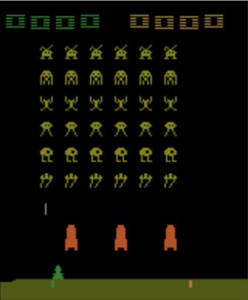

# AlphaAtari
> Play Atari game with Artificial intelligence

## Features
+ Deep reinforcement learning [1]
+ Curiosity-driven Exploration by Self-supervised Prediction [2,3]

## Requirements
+ Numpy
+ [OpenAI Gym](https://github.com/openai/gym#installing-everything)
+ Keras, Tensorflow

## How to use
+ Play Atari game by yourself

        cd alphaatari
        python alphaatari.py --play

+ Re-train AI model to play Atari game (Highly recommend to train it in GPU server)

        cd alphaatari
        python alphaatari.py --retrain --verbose

+ Continue to train AI model to play Atari game

        cd alphaatari
        python alphaatari.py --train --verbose

+ Watch AI model to play Atari game (Coming)

## References
1. Mnih, Volodymyr, et al. "Human-level control through deep reinforcement learning." Nature 518.7540 (2015): 529.
2. Achiam, Joshua, and Shankar Sastry. "Surprise-based intrinsic motivation for deep reinforcement learning." arXiv preprint arXiv:1703.01732 (2017).
3. Pathak, Deepak, et al. "Curiosity-driven exploration by self-supervised prediction." International Conference on Machine Learning (ICML). Vol. 2017. 2017.

## Extra
I found that it's hard and time-consuming to make a home-made Atari game, so that I decided to exploit the external libraries to achieve this goal, i.e, OpenAI gym.
